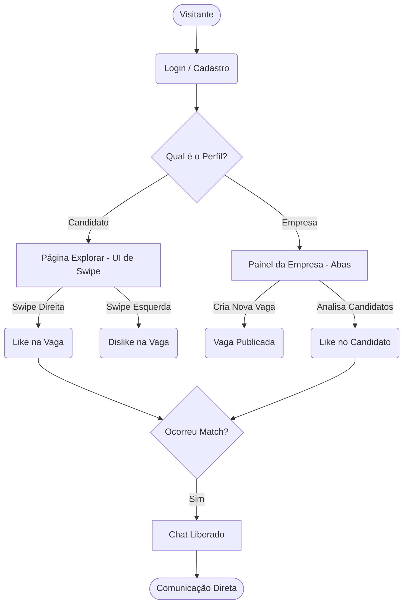

# 📘 Jobs por AI - Documentação Oficial

## 📌 Visão Geral
**Jobs por AI** é uma plataforma revolucionária de match profissional inspirada em mecânicas dinâmicas de aplicativos de relacionamento (como o Tinder). A ideia central é agilizar o recrutamento e seleção de candidatos de forma direta, sem formulários extensos e com máxima interatividade.

---

## ⚙️ Arquitetura e Tecnologias
O sistema foi construído visando robustez para cenários reais de acesso simultâneo:
- **Backend:** Python 3 + FastAPI (Totalmente assíncrono para máxima performance)
- **Banco de Dados:** SQLite acionado via `aiosqlite` + SQLAlchemy 2.0 (Modelagem 100% não bloqueante suportando múltiplos requests em paralelo sem travar o event-loop)
- **Frontend:** Jinja2 + TailwindCSS via CDN (Design system mobile-first, focado em alta interatividade, cards e micro-animações)
- **Mapas:** Leaflet.js para processamento de rotas e geolocalização visual.

---

## 🔄 Diagrama de Fluxo (Funil dos Usuários)

Abaixo, o fluxo lógico desde o acesso até a consolidação de uma vaga através de um Match.

---

## 📱 Telas do Sistema (UI/UX)

### 1. Autenticação (Login e Cadastro)
A tela de entrada foca em conversão rápida, com um visual premium utilizando backdrop-blurs e validações claras.
- **Desktop:** 
 

- **Mobile:**
  
  

### 2. Tela "Explorar" (A visão do Candidato)
O coração da experiência para quem procura emprego. As vagas são exibidas em formato de "Cartas" sobrepostas. O candidato avalia percentual de compatibilidade, pílulas de habilidades e distância em Km.
- **Interação:** Mouse drag no Desktop e Touch Swipe no Mobile. Se o usuário arrastar para a direita (LIKE), o sistema verifica imediatamente se houve um Match mútuo.
- **Desktop:**
- 

- **Mobile:**

  

### 3. Dashboard da Empresa (Gestão de Candidatos)
Em vez de listas cansativas, a empresa clica em abas (tabs horizontais) para alternar entre as vagas ativas. Ao selecionar uma vaga, uma API carrega em tempo real todos os candidatos que deram "Like", ordenados pela melhor compatibilidade.
- **Desktop:**

 
- **Mobile:**

 

### 4. Integração de Mapas (Leaflet)
Tanto candidatos quanto empresas têm à disposição mapas geográficos. Para não poluir ou "bugar" a tela mobile, o mapa fica encapsulado atrás de botões de expansão (`Ver localização`). No PC, ele pode ser exibido elegantemente ao lado dos cards.
- **Desktop:**
  

- **Mobile:**

  

### 5. Chat em Tempo Real
Quando ocorre o "Match", as partes são habilitadas a conversar.
- O sistema usa **Polling Incremental**: só baixa mensagens novas a cada 2 segundos via uma API `?after_id=X`, economizando tráfego de dados e sem repintar a tela (Zero "flickering" ou quebras de scroll).
- O sistema tem **Idempotência**: evita que a mesma mensagem seja cadastrada duas vezes seguidas se o usuário clicar sem parar ou se a rede lagar (intervalo seguro de 5s).
- **Desktop:**

- **Mobile:**

### 6. Perfil, Dashboard Analítico e Assinaturas
- **Desktop:**

  

- **Mobile:**
  

- **Dashboard:**

  
  

---

## 🎯 Monetização: Sistema de Assinaturas e Anúncios

O modelo de negócios é ancorado em um formato **Freemium** inteligente:

1. **Plano Free (Gratuito):**
   - O Candidato possui limites estritos de visualizações/likes diários (ex: 5 interações por dia). 
   - A interface insere nativamente caixas de alerta (Anúncios/Ads - os `AdEvents`) no meio do uso diário avisando sobre as vantagens dos planos Premium.
2. **Plano Básico / Anual:**
   - Remove o limite diário de swipes.
   - Remove permanentemente todas as barras de anúncios da interface.
3. **Premium IA (Agentes Autônomos):**
   - Garante que agentes varram ativamente o banco de dados. Assim que uma empresa publica uma vaga, caso a compatibilidade do candidato passe de 55%, o sistema gera o "Like" do usuário automaticamente.

---

## 🔐 Segurança Implementada
- **Sessões HMAC:** Controle de login via cookies encriptados via Hash, mitigando falsificações.
- **PBKDF2:** Uso de salt e hasheamento moderno para a custódia das senhas dos usuários.
- **Isolamento de Views:** Controle ríspido onde perfis "Empresa" não enxergam a rota `/explorar`, e "Candidatos" não burlam rotas de criação de vagas (`/empresa`).

---
